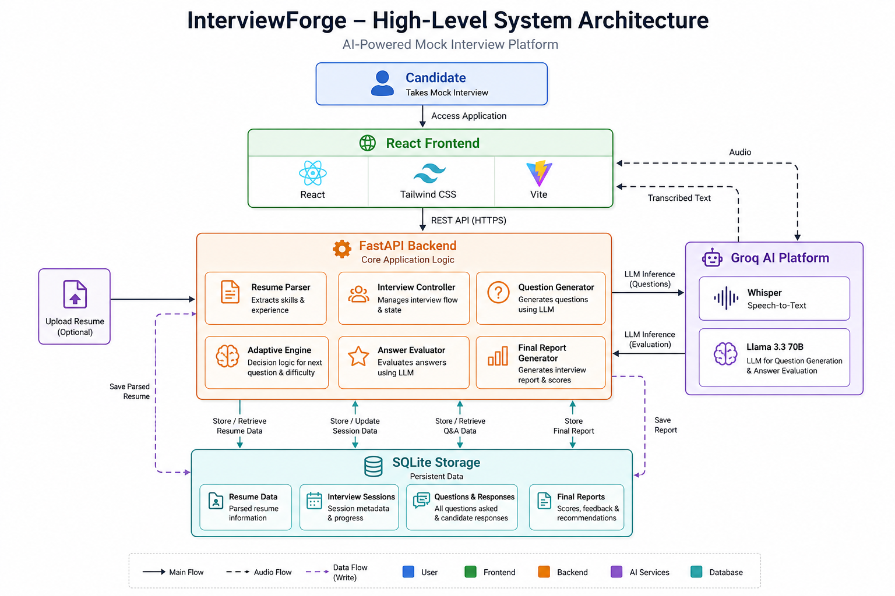
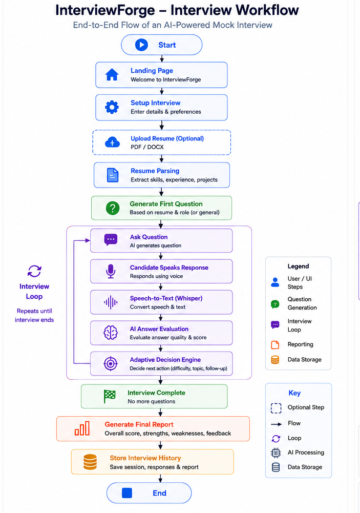

# 🎯 InterviewForge

<p align="center">

An AI-powered adaptive mock interview platform that conducts personalized technical interviews, evaluates candidate responses using Large Language Models (LLMs), dynamically adjusts interview difficulty, and generates comprehensive performance reports.

Built using **React**, **FastAPI**, **Groq**, **Whisper**, **Supabase PostgreSQL**, **Vercel**, and **Render**.

</p>

---

## 🌐 Live Demo

🔗 **Frontend:** https://interview-forge-mu.vercel.app

---

# 📌 Overview

InterviewForge is an AI-powered mock interview platform designed to simulate realistic technical interviews.

Unlike traditional interview practice platforms that rely on static question banks, InterviewForge dynamically adapts every interview based on the candidate's responses. It generates personalized technical questions, evaluates spoken answers using Large Language Models (LLMs), adjusts interview difficulty in real time, and produces a detailed performance report at the end of the interview.

The platform helps students and professionals prepare for internships, placements, and software engineering interviews through an interactive, AI-driven interview experience.

---

# ✨ Features

## 🤖 AI Interview Engine

- Adaptive interview flow
- Dynamic question generation
- Resume-aware interviews
- Context-aware follow-up questions
- Dynamic difficulty adjustment

---

## 📄 Resume Intelligence

- Optional resume upload
- Resume parsing
- Skill extraction
- Experience analysis
- Resume-based interview questions

---

## 🎙️ Voice Interview

- Voice recording
- Speech-to-text transcription
- Automatic answer submission
- Replay question support
- Real-time voice interaction

---

## 🧠 AI Evaluation

- Technical answer evaluation
- Communication assessment
- AI-generated feedback
- Strength identification
- Weakness analysis
- Personalized improvement suggestions

---

## 📊 Reports

- Overall interview score
- Question-wise review
- Strengths
- Weaknesses
- Suggestions
- Interview history

---

# 🏗️ System Architecture

<p align="center">
    
</p>

---

# 🔄 Interview Workflow

<p align="center">
    
</p>

---

# 💻 Tech Stack

| Layer | Technology |
|---------|----------------------------|
| Frontend | React + Vite |
| Styling | Tailwind CSS |
| Backend | FastAPI |
| AI | Groq Llama 3.3 70B |
| Speech-to-Text | Groq Whisper |
| Database | Supabase PostgreSQL |
| ORM | SQLAlchemy |
| Resume Parsing | PyPDF2 + python-docx |
| Deployment | Vercel + Render |
| Version Control | Git + GitHub |

---

# 📂 Project Structure

```text
InterviewForge/
│
├── frontend/
│   ├── public/
│   └── src/
│       ├── assets/
│       ├── components/
│       ├── context/
│       ├── hooks/
│       ├── pages/
│       ├── services/
│       └── utils/
│
├── backend/
│   ├── database/
│   ├── interview/
│   ├── models/
│   ├── routes/
│   ├── schemas/
│   ├── services/
│   ├── utils/
│   └── main.py
│
├── docs/
│   ├── images/
│   └── InterviewForge_Documentation.pdf
│
├── README.md
├── requirements.txt
└── runtime.txt
```

---

# ⚙️ Interview Pipeline

```text
Candidate
      │
      ▼
Setup Interview
      │
      ▼
Resume Upload (Optional)
      │
      ▼
Resume Parsing
      │
      ▼
Resume Analysis
      │
      ▼
Generate First Question
      │
      ▼
Candidate Response
      │
      ▼
Speech-to-Text
      │
      ▼
AI Answer Evaluation
      │
      ▼
Adaptive Decision Engine
      │
      ▼
Generate Next Question
      │
      ▼
Repeat Until Completion
      │
      ▼
Generate Final Report
      │
      ▼
Store Interview History
```

---

# 🌐 API Overview

| Method | Endpoint | Description |
|----------|----------------------------|--------------------------------|
| POST | `/api/upload_resume` | Upload and analyze resume |
| POST | `/api/start_interview` | Start interview session |
| GET | `/api/next_question` | Generate next interview question |
| POST | `/api/evaluate` | Evaluate candidate response |
| POST | `/api/transcribe` | Convert speech to text |
| POST | `/api/finish_interview` | Generate final report |
| GET | `/api/history` | Retrieve interview history |

Interactive API documentation is automatically generated using **FastAPI Swagger UI**.

---

# ☁️ Deployment

| Component | Platform |
|------------|----------|
| Frontend | Vercel |
| Backend | Render |
| Database | Supabase PostgreSQL |
| AI Services | Groq |
| Source Code | GitHub |

---

# 🚀 Local Setup

## Clone Repository

```bash
git clone https://github.com/ThrishahK/InterviewForge.git

cd InterviewForge
```

---

## Backend

```bash
cd backend

pip install -r requirements.txt

uvicorn main:app --reload
```

---

## Frontend

```bash
cd frontend

npm install

npm run dev
```

---

# 🔑 Environment Variables

### Backend (`backend/.env`)

```env
DATABASE_URL=

GROQ_API_KEY=

CLOUDINARY_CLOUD_NAME=

CLOUDINARY_API_KEY=

CLOUDINARY_API_SECRET=
```

### Frontend (`frontend/.env`)

```env
VITE_API_BASE_URL=
```

---

# 📚 Documentation

Complete project documentation is available in the **docs** directory.

It includes:

- Software Architecture
- Frontend Architecture
- Backend Architecture
- Database Design
- API Design
- Adaptive Interview Algorithms
- AI Pipelines
- Deployment Architecture
- Technology Decisions
- Security Considerations
- Performance Considerations
- Development Challenges
- Development Journal

---

# 🚀 Future Scope

InterviewForge is designed to evolve into a comprehensive AI-powered career preparation platform.

Planned enhancements include:

- User authentication
- Coding interviews
- Company-specific interview modes
- Job description–based interviews
- ATS resume analysis
- AI learning roadmap
- AI career mentor
- Behavioral interviews
- Video interview analysis
- System design interviews
- Enterprise recruiter dashboard

---

# 🤝 Contributing

Contributions are welcome.

1. Fork the repository
2. Create a feature branch
3. Commit your changes
4. Push the branch
5. Open a Pull Request

---

# 📄 License

This project is licensed under the **MIT License**.

---

# 🙏 Acknowledgements

Special thanks to the communities behind:

- React
- FastAPI
- Tailwind CSS
- SQLAlchemy
- Supabase
- PostgreSQL
- Groq
- Whisper
- Vercel
- Render

---

# 🌟 Vision

InterviewForge aims to become an intelligent AI-powered career companion that helps students and professionals prepare for technical interviews through adaptive interviewing, personalized feedback, skill-gap analysis, and continuous learning guidance.

---

<div align="center">

⭐ If you found this project interesting, consider giving it a star!

Built with ❤️ by **Thrisha K**

</div>
